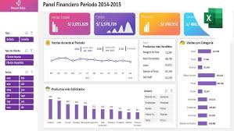

# Sistema Web de Control de Gastos Personales con IA

Aplicación web full stack para registrar ingresos y gastos, analizar el balance personal por categorías y recibir orientación financiera mediante inteligencia artificial. El sistema incluye autenticación, perfiles, suscripciones PRO y un panel administrativo para gestionar usuarios y consultar métricas generales.

## Características principales

- Registro e inicio de sesión con correo y contraseña o Google.
- Perfil financiero con salario, información familiar y categorías personalizadas.
- Registro, consulta y seguimiento de ingresos y gastos.
- Resumen del balance y distribución de movimientos por categoría.
- Historial de transacciones.
- Suscripción al plan PRO mediante Stripe Checkout.
- Asistente financiero con IA para usuarios PRO.
- Control de acceso basado en roles de usuario y administrador.
- Diseño adaptable a computadoras, tabletas y dispositivos móviles.

## Dashboards

### Dashboard de usuario

El panel personal concentra la información financiera necesaria para dar seguimiento a los movimientos del usuario. Desde esta vista se puede:

- Consultar el total de ingresos, gastos y balance disponible.
- Revisar los valores agrupados por las categorías seleccionadas.
- Registrar nuevos ingresos y gastos mediante formularios modales.
- Consultar el historial de transacciones.
- Acceder a los beneficios del plan PRO.
- Conversar con el asistente financiero de IA cuando la cuenta tiene una suscripción PRO activa.
- Abrir el perfil o cerrar la sesión.

<p align="center">
  
</p>

### Dashboard de administrador

El panel administrativo ofrece una visión global del sistema y herramientas de gestión. Sus módulos permiten:

- Consultar el total de usuarios registrados, activos y con plan PRO.
- Revisar perfiles completos e incompletos.
- Visualizar las categorías más utilizadas.
- Consultar usuarios recientes y sus estados.
- Cambiar roles y activar o desactivar cuentas.
- Eliminar usuarios.
- Analizar estadísticas por estado, rol, plan, perfil y categoría mediante gráficos.
- Consultar los datos del perfil administrador.

<p align="center">
  
</p>

> Las imágenes son recursos visuales de referencia incluidos en el proyecto.

## Tecnologías

| Capa | Tecnologías |
| --- | --- |
| Frontend | React 19, Vite, React Router, Recharts y Lucide React |
| Backend | Node.js, Express 5 y API REST |
| Datos y autenticación | Supabase Auth y PostgreSQL |
| Pagos | Stripe Checkout y webhooks |
| Inteligencia artificial | Hugging Face Inference |
| Despliegue | Netlify para el frontend y configuración de Vercel para el backend |

## Arquitectura del proyecto

```text
Sistema_de_Gastos/
├── Frontend/                 # Interfaz de usuario en React
│   └── src/
│       ├── assets/           # Imágenes y recursos visuales
│       ├── components/       # Componentes reutilizables
│       ├── pages/            # Vistas de la aplicación
│       ├── routes/           # Rutas públicas y protegidas
│       ├── services/         # Comunicación con la API y Supabase
│       └── styles/           # Estilos globales y por módulo
├── backend/                  # API REST en Express
│   └── src/
│       ├── config/           # Supabase, Stripe y Hugging Face
│       ├── controllers/      # Lógica de las solicitudes
│       ├── middlewares/      # Autenticación, roles y plan PRO
│       ├── routes/           # Endpoints de la API
│       └── services/         # Servicios externos
├── API.md                    # Documentación de endpoints
└── README.md
```

## Requisitos previos

- Node.js 20 o superior.
- npm.
- Un proyecto de Supabase con Auth configurado y las tablas `profiles`, `expenses` e `incomes`.
- Una cuenta de Stripe para habilitar las suscripciones PRO.
- Un token de Hugging Face para el asistente financiero.

## Instalación

1. Clone el repositorio y acceda a su directorio:

   ```bash
   git clone <URL_DEL_REPOSITORIO>
   cd Sistema_de_Gastos
   ```

2. Instale las dependencias del backend:

   ```bash
   cd backend
   npm install
   ```

3. Cree el archivo `backend/.env`:

   ```env
   PORT=4000
   FRONTEND_URL=http://localhost:5173

   SUPABASE_URL=
   SUPABASE_ANON_KEY=
   SUPABASE_SERVICE_ROLE_KEY=

   STRIPE_SECRET_KEY=
   STRIPE_WEBHOOK_SECRET=
   STRIPE_PRICE_ID=

   HF_TOKEN=
   HF_MODEL=
   HF_PROVIDER=
   ```

4. Instale las dependencias del frontend:

   ```bash
   cd ../Frontend
   npm install
   ```

5. Cree el archivo `Frontend/.env`:

   ```env
   VITE_API_URL=http://localhost:4000
   VITE_SUPABASE_URL=
   VITE_SUPABASE_ANON_KEY=
   ```

## Ejecución local

Inicie el backend y el frontend en terminales diferentes.

```bash
# Terminal 1: API
cd backend
npm run dev
```

```bash
# Terminal 2: aplicación web
cd Frontend
npm run dev
```

Abra la dirección indicada por Vite, normalmente `http://localhost:5173`.

## Flujo de uso

1. Cree una cuenta o inicie sesión con Google.
2. Complete el perfil con sus datos financieros y categorías.
3. Registre ingresos y gastos con fecha, título, monto y descripción opcional.
4. Consulte el balance, los totales por categoría y el historial.
5. Si desea las funciones premium, contrate el plan PRO mediante Stripe Checkout.
6. Cuando Stripe confirme el pago a través del webhook, el perfil se actualizará a PRO.
7. Las cuentas PRO podrán utilizar el asistente financiero con IA.
8. Los administradores podrán ingresar al panel protegido para gestionar usuarios y consultar estadísticas.

## Rutas principales

| Ruta | Acceso | Descripción |
| --- | --- | --- |
| `/` | Público | Página de presentación |
| `/home` | Público | Inicio de sesión |
| `/register` | Público | Registro de cuenta |
| `/forgot-password` | Público | Solicitud de recuperación de contraseña |
| `/update-password` | Público | Actualización de contraseña |
| `/dashboardUser` | Usuario autenticado | Dashboard financiero personal |
| `/profile` | Usuario autenticado | Consulta y edición del perfil |
| `/pricing` | Público | Información y contratación del plan PRO |
| `/payment/success` | Público | Confirmación de pago completado |
| `/payment/cancel` | Público | Aviso de pago cancelado |
| `/admin-test` | Administrador | Dashboard y gestión administrativa |

## Scripts disponibles

| Ubicación | Comando | Descripción |
| --- | --- | --- |
| `backend/` | `npm run dev` | Ejecuta la API con Nodemon |
| `backend/` | `npm start` | Ejecuta la API con Node.js |
| `Frontend/` | `npm run dev` | Inicia Vite en modo desarrollo |
| `Frontend/` | `npm run build` | Genera la versión de producción |
| `Frontend/` | `npm run preview` | Sirve localmente la compilación |
| `Frontend/` | `npm run lint` | Analiza el código con ESLint |

## API

La documentación de rutas, parámetros, respuestas y ejemplos está disponible en [API.md](API.md).

## Seguridad

- No publique archivos `.env`, tokens ni claves privadas.
- Mantenga `SUPABASE_SERVICE_ROLE_KEY` únicamente en el backend.
- El backend valida el token de Supabase en las rutas protegidas.
- Los middlewares restringen las funciones administrativas y las funciones exclusivas del plan PRO.
- En producción, configure correctamente `FRONTEND_URL`, CORS y el webhook de Stripe.
- Nunca exponga `STRIPE_SECRET_KEY`, `STRIPE_WEBHOOK_SECRET` ni `HF_TOKEN` en el frontend.

## Licencia

Este proyecto fue desarrollado con fines académicos. Agregue una licencia antes de distribuirlo o utilizarlo en producción.
